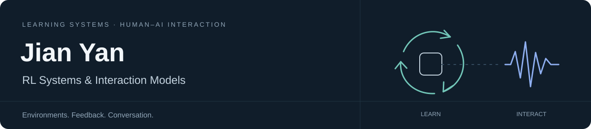

  

# Hi, I'm Jian Yan · 颜简

I'm interested in **RL Systems** and **Interaction Models**: the infrastructure that lets agents learn from environments, and the models that make human–AI interaction more natural.

[Website](https://jianyan11.github.io/) · [Email](mailto:23331109@bjtu.edu.cn) · [X](https://x.com/JustinY38017) · [Open-source contributions](https://github.com/pulls?q=is%3Apr+author%3AJianYan11+archived%3Afalse)

## What I'm exploring

### RL Systems

How can we make environment interaction reliable enough for learning at scale?

- **Environment infrastructure:** session isolation, resource lifecycles, and recovery from failures.
- **Rollout and evaluation harnesses:** reproducible trajectories, reliable tool execution, and feedback for post-training.
- **Current work:** contributing to [Hugging Face OpenEnv](https://github.com/huggingface/OpenEnv), with a focus on client lifecycles and MCP runtime compatibility.

### Interaction Models

How should a model listen, reason, and respond in a live conversation?

- **Real-time voice:** turn-taking, interruptions, streaming responses, and response latency.
- **Multimodal dialogue:** understanding context across speech, vision, and text.
- **Adaptive reasoning:** choosing when to respond quickly and when to spend more time thinking.
- **Current work:** contributing to [TEN Framework](https://github.com/TEN-framework/ten-framework), including an optional voice router for thinking and non-thinking modes.

## Selected open-source work

| Project | My contribution | Link |
| --- | --- | --- |
| **OpenEnv** | Recover resources after failed session startup; prevent retries from overwriting unresolved cleanup obligations. | [#1145 · Merged](https://github.com/huggingface/OpenEnv/pull/1145) |
| **OpenEnv** | Propose a FastMCP 4 migration that preserves managed session semantics and supports harness sampling guards. | [#1304 · Proposal](https://github.com/huggingface/OpenEnv/pull/1304) |
| **TEN Framework** | Add an opt-in Jev router for voice assistants to switch between thinking and non-thinking modes, keeping reasoning separate from spoken output. | [#2344 · Merged](https://github.com/TEN-framework/ten-framework/pull/2344) |

More contributions around environments and evaluation

- [WorkArena #157](https://github.com/ServiceNow/WorkArena/pull/157) — check HTTP status before decoding API responses.
- [AgentEvals #113](https://github.com/langchain-ai/agentevals/pull/113) — preserve input messages during trajectory normalization.
- [EvalPlus #316](https://github.com/evalplus/evalplus/pull/316) — respect dataset versions when loading and hashing HumanEval+.

## A little more about me

I study Electronic Information at **Beijing Jiaotong University**, and pursue a second degree in Economics at **Peking University's National School of Development**. My earlier work includes [semi-supervised ionogram detection](https://github.com/JianYan11/SEMI-DETR) and computational imaging.

I enjoy turning ideas into working software and tracing problems from observed behavior to the underlying system. If you're working on RL environment infrastructure or real-time human–AI interaction, I'd love to compare notes.
